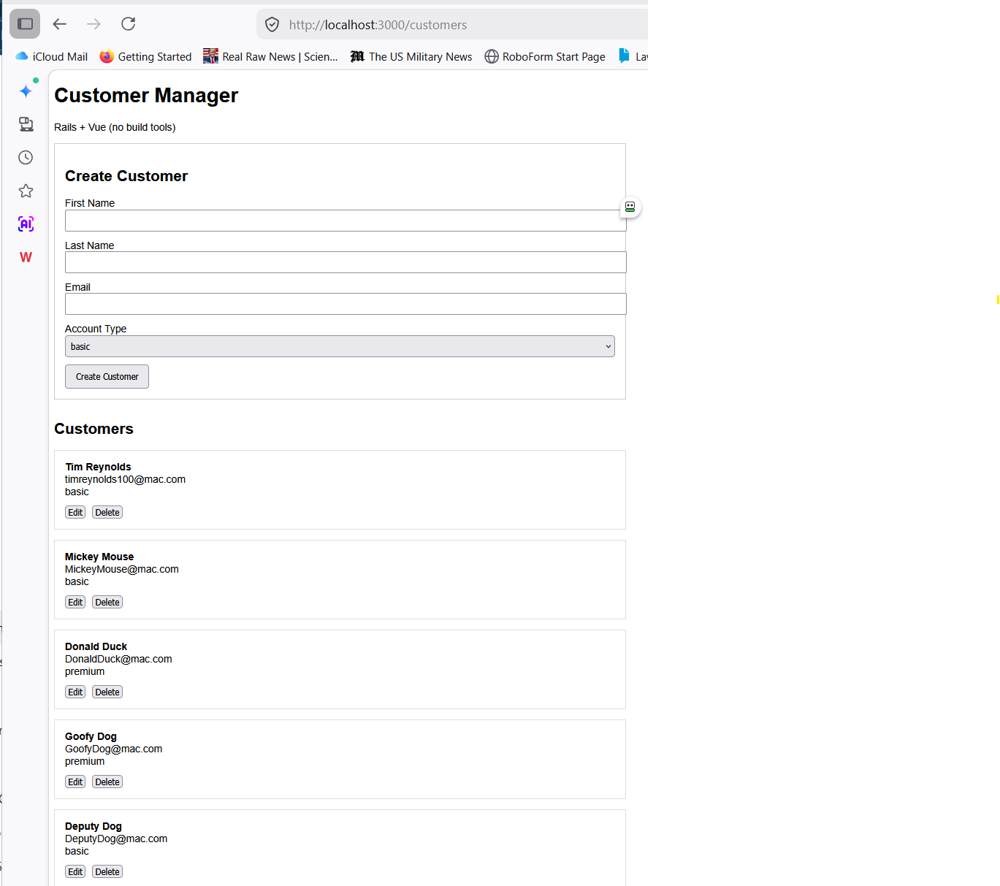
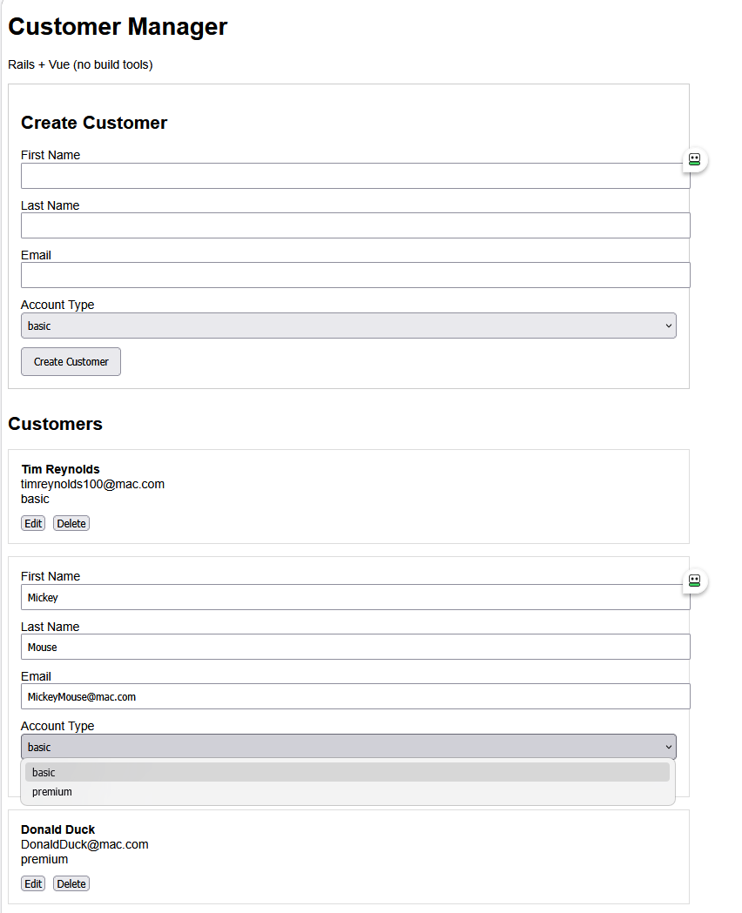
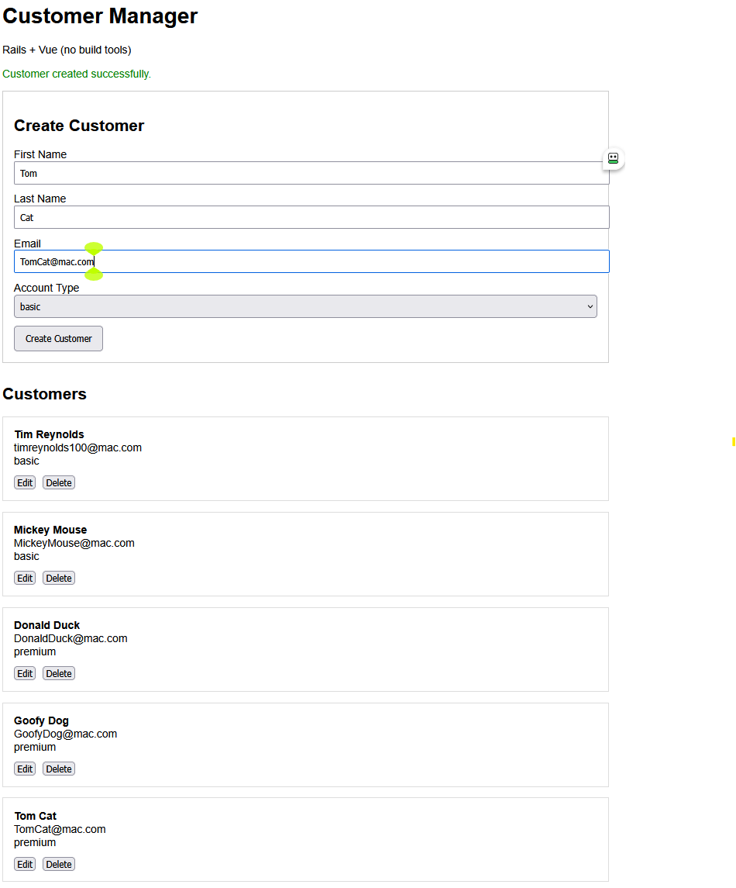

# Customer Manager (Rails + Vue)

A simple full-stack CRUD application built with **Ruby on Rails** and **Vue 3**.

This project demonstrates a complete client-server workflow, including API design, database persistence, and a reactive frontend UI.

---

## 🚀 Features

- Create customers
- View all customers
- Inline edit customers
- Delete customers
- JSON API backend
- Vue-powered frontend (no build tools)

---

## 🧱 Tech Stack

**Backend**
- Ruby on Rails 8
- ActiveRecord
- SQLite (development)

**Frontend**
- Vue 3 (via CDN)
- Fetch API (no Axios or build tools)

---

## 🏗 Architecture

- Rails serves as a **JSON API backend**
- Vue runs inside a Rails view (`.erb`)
- Frontend communicates with backend using `fetch`
- REST-style endpoints power all operations

---

## 📡 API Endpoints

| Method | Endpoint            | Description        |
|--------|---------------------|--------------------|
| GET    | /api/status         | Health check       |
| GET    | /api/customers      | List all customers |
| POST   | /api/customers      | Create a customer  |
| PATCH  | /api/customers/:id  | Update a customer  |
| DELETE | /api/customers/:id  | Delete a customer  |

---

## 🖥 UI

Accessible at:

`http://localhost:3000/customers`

### Capabilities
- Create new customers via form
- Edit customers inline (no page reload)
- Delete customers instantly
- Displays success and error messages

---

## 📸 Screenshots

### Customer List + Create Form


### Inline Editing


### Create Success


---

## ⚙️ Setup Instructions

### 1. Clone the repo

```bash
git clone <your-repo-url>
cd myapp
